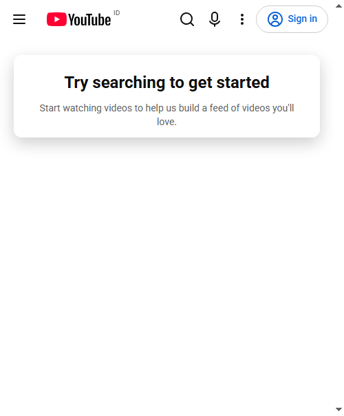

# Chrome Automation Manager

Sebuah **browser session orchestration platform** untuk menjalankan, mengisolasi, dan mengontrol banyak sesi Chrome dari satu komputer — dirancang untuk kebutuhan automation, QA/testing, dan pengembangan tooling browser.

## Overview

Chrome Automation Manager mengelola banyak proses Chrome secara bersamaan, masing-masing dengan profile (user-data-directory), konfigurasi device, dan siklus hidup yang terisolasi satu sama lain. Sistem berjalan lokal pada satu PC, dikendalikan lewat sebuah dashboard, dan menggunakan Chrome DevTools Protocol (CDP) sebagai fondasi kontrol browser.

## Why This Project?

Menjalankan banyak instance Chrome secara manual untuk keperluan testing lintas-akun, lintas-device, atau automation berulang itu tidak scalable dan rawan kesalahan (profile bentrok, proses menggantung, tidak ada visibilitas status). Proyek ini menyediakan fondasi terstruktur: satu Application Core yang mengelola siklus hidup banyak Chrome session secara aman, terisolasi, dan dapat diamati.

## Core Features (Target MVP)

- Manajemen banyak Chrome session (create/start/stop/restart/delete)
- Profile isolation penuh per session (cookies, cache, storage, history terpisah)
- Kontrol browser via CDP (navigasi, tab, screenshot, eksekusi runtime, dsb.)
- Extension Agent (Manifest V3) sebagai page-level worker, opsional per session
- Emulasi device (desktop/mobile/tablet) melalui CDP, bukan virtualisasi Android
- Dashboard untuk memonitor status, resource, dan log tiap session
- Automation engine generik (workflow berbasis step sederhana)
- Observability: logs, metrics, events

## Architecture

```
Dashboard → Application Core → Session Manager → Chrome Manager → Chrome Process
                                              └──→ CDP Controller → Chrome DevTools Protocol
                                              └──→ Extension Agent (opsional, page-level)
```

Prinsip inti: **CDP adalah lapisan kontrol browser utama. Extension adalah agent opsional untuk tugas page-level, bukan pusat sistem.**

Detail lengkap ada di [`docs/architecture.md`](docs/architecture.md).

## How It Works

1. User membuat session lewat dashboard.
2. Application Core menyiapkan profile directory baru dan mengalokasikan debug port.
3. Chrome Manager meluncurkan proses Chrome dengan profile tersebut.
4. CDP Controller terhubung ke Chrome untuk kontrol browser-level.
5. (Opsional) Extension Agent terpasang dan melakukan registrasi + heartbeat ke Application Core.
6. Session berstatus `RUNNING` dan siap menerima command atau menjalankan automation workflow.

## Project Structure

```
chrome-automation-manager/
├── app/                # Application core: session, chrome, cdp, extension, automation, monitoring, events
├── dashboard/          # UI kontrol panel
├── extension/          # Chrome Extension (Manifest V3) — agent
├── data/                # profiles, logs, screenshots (runtime data, tidak di-commit)
├── tests/
├── docs/                # Dokumentasi arsitektur (sumber kebenaran utama)
└── README.md
```

## Technology Stack (Kandidat, lihat ADR-004)

- Desktop shell: Tauri (kandidat awal, lihat perbandingan di ADR-004)
- Core/backend: Node.js + TypeScript
- Frontend dashboard: React + TypeScript + Tailwind
- Database: SQLite
- Browser control: Chrome DevTools Protocol
- Extension: Manifest V3 + TypeScript

## Current Scope

Single PC, single user, local-only orchestration untuk sejumlah kecil session (target awal 5, didesain agar bisa berkembang ke ±20 tanpa perubahan arsitektur besar).

## Non-Goals (Saat Ini)

- Emulator Android / device fisik
- Deployment cloud / multi-server
- Manajemen proxy, fingerprint spoofing, anti-deteksi, bypass CAPTCHA, rotasi IP
- Account farming atau manipulasi engagement (like/view/follow) pada platform pihak ketiga

Proyek ini adalah **automation/testing/dev tool**, bukan alat untuk menghindari sistem keamanan platform pihak ketiga.

## Development Roadmap

Lihat [`docs/roadmap.md`](docs/roadmap.md).

## Security & Responsible Use

Proyek ini ditujukan untuk automation dan testing yang sah (mengendalikan browser yang dimiliki/dikendalikan pengguna sendiri, mis. untuk QA internal). Lihat [`docs/security.md`](docs/security.md) untuk model ancaman dan batasan penggunaan.

## Documentation

| Dokumen | Isi |
|---|---|
| [docs/architecture.md](docs/architecture.md) | Arsitektur sistem, komponen, data flow, keputusan desain |
| [docs/browser-sessions.md](docs/browser-sessions.md) | Konsep session, profile isolation, lifecycle Chrome, device emulation |
| [docs/automation.md](docs/automation.md) | Automation engine, workflow, command, error handling |
| [docs/security.md](docs/security.md) | Threat model, autentikasi, secrets, batasan automation |
| [docs/roadmap.md](docs/roadmap.md) | Fase development dan acceptance criteria |

## Project Status

**Phase 0 — Documentation & Architecture.** Belum ada implementasi kode; fondasi desain sedang difinalisasi sebelum development dimulai.

## Phase 1 Progress Update

### Status saat ini
**Phase 1 — Chrome Launcher** telah dibangun dan divalidasi secara fungsional.

Yang sudah berhasil dibuat:
- `Profile Manager` untuk membuat direktori profile terisolasi per session
- `Port Allocator` untuk memilih port Chrome debug yang tersedia
- `Chrome Manager` untuk mengeksekusi `chrome.exe` dan menjalankan proses Chrome
- `CLI` untuk menjalankan perintah `launch` dan `stop`
- test otomatis untuk validasi core logic phase 1

### Hasil yang sudah terbukti
Berdasarkan eksekusi yang berhasil:
- `npm test` -> 3 test pass, 0 fail
- `npx tsx app/cli/index.ts launch demo-session 9222` -> Chrome berhasil diluncurkan dengan PID

Output launch yang berhasil:

```json
{
  "command": "launch",
  "sessionId": "demo-session",
  "profilePath": "C:\\laragon\\www\\Chrome-Automation-Manager\\data\\profiles\\demo-session",
  "debugPort": 9222,
  "pid": 7444
}
```

### Acceptance Criteria Phase 1
Status validasi:
- [x] bisa meluncurkan Chrome dengan profile terisolasi
- [x] bisa memilih port debug yang tersedia
- [x] proses Chrome bisa dijalankan via CLI
- [x] proses bisa dihentikan dengan perintah stop
- [x] core logic telah lewat test otomatis

### Bukti screenshot hasil berjalan


### Command yang bisa dipakai

```powershell
cd C:\laragon\www\Chrome-Automation-Manager
npx tsx app/cli/index.ts launch demo-session 9222
npx tsx app/cli/index.ts stop demo-session
```

### Catatan teknis
- Path Chrome yang dipakai adalah executable Windows: `C:\Program Files\Google\Chrome\Application\chrome.exe`
- Pada Windows, file `.lnk` tidak bisa dipakai sebagai executable; project memanggil file `.exe` secara langsung
- Untuk override path di environment, bisa pakai `CHROME_BIN`

## License

Belum ditentukan (TBD).

## Phase 2 Progress Update

### Status saat ini
**Phase 2 — CDP Controller** pekerjaan inti untuk mengendalikan Chrome lewat Chrome DevTools Protocol (CDP) telah diimplementasikan dan divalidasi pada level dasar.

Yang sudah berhasil dibuat:
- `CDP Controller` — koneksi ke CDP, logika reconnect/retry, dan helper untuk `navigate` dan `captureScreenshot`.
- CLI `cdp` subcommands: `cdp navigate <port> <url>` dan `cdp screenshot <port> [out.png]`.
- Penanganan readiness endpoint (`/json/version`) sebelum mencoba koneksi CDP.
- Test E2E dasar untuk CDP Controller (meluncurkan Chrome, navigasi, screenshot, dan cleanup).
- CLI `status` command untuk melihat session yang tersedia, PID, dan apakah proses berjalan.

### Acceptance criteria Phase 2 (current)
- [x] koneksi CDP berhasil dan dapat melakukan navigasi dasar
- [x] screenshot via CDP tersedia
- [x] reconnect logic saat endpoint belum siap atau koneksi terputus
- [ ] integrasi CDP ke automation engine (next)

### Cara mencoba fitur Phase 2
1. Jalankan Chrome session:

```powershell
npx.cmd tsx app/cli/index.ts launch session1 9222
```

2. Pastikan endpoint CDP siap:

```powershell
Invoke-RestMethod http://127.0.0.1:9222/json/version | ConvertTo-Json
```

3. Navigasi melalui CDP dan ambil screenshot:

```powershell
npx.cmd tsx app/cli/index.ts cdp navigate 9222 https://youtube.com
npx.cmd tsx app/cli/index.ts cdp screenshot 9222 youtube.png
```
#### Hasil Screenshot


4. Periksa status session:

```powershell
npx.cmd tsx app/cli/index.ts status
```

5. Hentikan session:

```powershell
npx.cmd tsx app/cli/index.ts stop session1
```

Jika Anda menemui masalah dengan menjalankan `npx` pada PowerShell karena kebijakan eksekusi, gunakan `npx.cmd` atau jalankan `node node_modules/tsx/dist/cli.mjs ...`.

### Next steps
- Dokumentasi lebih lengkap di `docs/automation.md` (akan diperbarui).
- Integrasi CDP Controller ke automation engine (Phase 2 → Phase 3 work).

## Phase 3 Progress Update

### Status saat ini
**Phase 3 — Automation Engine & Workflow Runner** telah diimplementasikan.

Yang sudah berhasil dibuat:
- `AutomationEngine` — lapisan high-level atas `CDPController` untuk `navigate`, `click`, `type`, `evaluate`, `screenshot`.
- `workflow-runner` + CLI `run <workflow>` untuk mengeksekusi file JSON/YAML workflow.
- Recovery dasar: `workflow-runner` dapat mencoba `ChromeManager.restart(sessionId, port)` ketika CDP tidak bisa diakses dan `session` disediakan di workflow.
- Logging ringan: `app/utils/logger.ts` menulis ke `logs/automation.log`.
- E2E tests untuk `AutomationEngine` dan `workflow-runner`.

### Acceptance criteria Phase 3
- [x] automation engine mampu menjalankan langkah dasar (`navigate`, `screenshot`) via CDP
- [x] workflow-runner dapat mengeksekusi file workflow dan menyimpan output (screenshot)
- [x] recovery: workflow bisa meminta restart untuk `session` bila endpoint CDP tidak responsif

### Cara mencoba fitur Phase 3
1. Buat Chrome session (jika ingin recovery otomatis sertakan `session` di workflow):

```powershell
npx.cmd tsx app/cli/index.ts launch session1 9222
```

2. Contoh workflow JSON (`workflow.json`):

```json
{
  "session": "session1",
  "port": 9222,
  "steps": [
    { "action": "navigate", "url": "https://example.com" },
    { "action": "screenshot", "out": "example.png" }
  ]
}
```

3. Jalankan workflow:

```powershell
npx.cmd tsx app/cli/index.ts run workflow.json
```

4. Periksa `logs/automation.log` untuk catatan operasi dan `example.png` untuk hasil screenshot.

## Phase 4 Progress Update

### Status saat ini
**Phase 4 — Extension Agent** telah dibangun pada level implementasi awal dan siap menjadi fondasi untuk dashboard dan operasi page-level.

Yang sudah berhasil dibuat:
- `Extension Agent` berbasis Manifest V3 dengan background/service worker yang kompatibel dengan runtime Chrome extension.
- Protokol agent untuk registrasi, heartbeat, queue command, dan ACK/retry antara extension dan Application Core.
- Validasi `HMAC` + `nonce` pada saat registrasi agar request tidak bisa dipalsukan.
- Penyesuaian kompatibilitas runtime agar extension tidak gagal karena `process`, `window`, atau global Node yang tidak tersedia di browser extension.
- Command queue yang disimpan dan diproses berulang sampai ACK diterima.
- Mode `DASHBOARD_DRY_RUN=true` untuk menguji lifecycle session tanpa harus menjalankan Chrome secara nyata.

### Acceptance criteria Phase 4
- [x] extension dapat melakukan registrasi ke server lokal
- [x] koneksi session dapat dipantau via heartbeat
- [x] command queue dan retry/ACK didukung
- [x] kode aman terhadap runtime Chrome extension yang tidak memiliki globals Node
- [ ] validasi full end-to-end pada browser nyata untuk page-level action masih perlu pengujian lanjutan di lingkungan nyata

### Catatan penting
Phase 4 sudah cukup kuat untuk menjadi dasar sebelum masuk ke Phase 5 (dashboard UI). Namun, ini masih merupakan implementasi MVP agent. Fitur page-level action dan recovery lanjutan tetap perlu diuji dan diperkuat sebelum dianggap siap untuk produksi multi-account.

---


